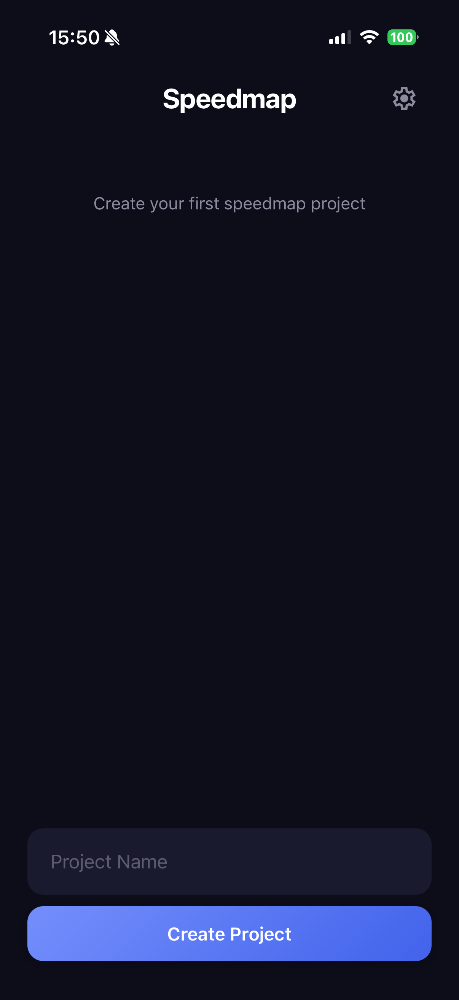
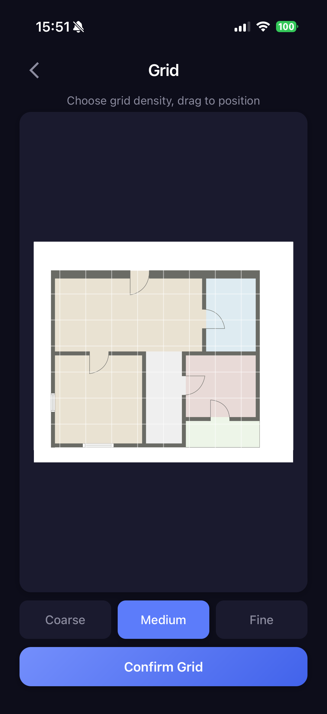
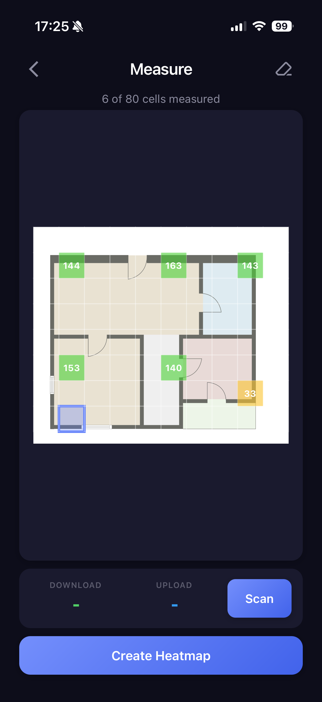
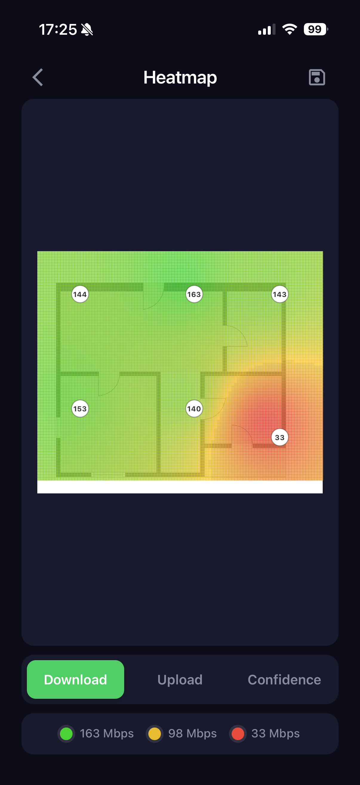

# Speedmap
<p align="center">
  
</p>

> **Note:** This app is currently in early testing. Expect bugs and breaking changes.

Measure WiFi speed at different locations in your home and visualize the results as a heatmap on your floorplan. Find dead zones, optimize router placement, and understand your network coverage.

**Free to use, modify, and distribute.**

## Screenshots

<p align="center">
  
  
</p>
<p align="center">
  
  
</p>

## Features

- Upload any floorplan image
- Adjustable grid density (Coarse / Medium / Fine)
- Multiple speed test runs for accuracy
- Download, Upload, and Confidence heatmaps
- Pinch-to-zoom on measure screen
- All data stored locally
- Dark mode UI

## Install (iOS)

1. Install [AltStore](https://altstore.io/) on your iPhone
2. Open this link on your iPhone or tap "Add Source" in AltStore:

```
https://raw.githubusercontent.com/intervall-ludger/wlan-heatmap/main/altstore/source.json
```

3. Find **Speedmap** in AltStore and tap Install

With a free Apple ID the app needs to be refreshed every 7 days. AltStore does this automatically when your iPhone and Mac are in the same WiFi.

## How It Works

1. **Create a project** and upload your floorplan
2. **Set the grid** density and position
3. **Measure** by tapping cells and running speed tests
4. **View the heatmap** with interpolated values

## Interpolation

The heatmap uses Inverse Distance Weighting (IDW):

```
z(x,y) = Σ(wᵢ · zᵢ) / Σ(wᵢ)    where wᵢ = 1 / dᵢ²
```

- `zᵢ` = measured speed at point i
- `dᵢ` = distance from (x,y) to point i

Closer measurements have more influence on the interpolated value.

## Privacy

All data is stored locally on your device. No data is sent to external servers except for the speed test itself (Cloudflare).

---

## Development

### Prerequisites

- [Rust](https://rustup.rs/)
- Xcode
- `jq` (`brew install jq`)

### Setup

```bash
cp .env.example .env
```

Edit `.env` and set your Apple Development Team ID:

```
DEVELOPMENT_TEAM=your-apple-team-id
```

Find your Team ID with: `security find-identity -v -p codesigning`

### Build iOS

```bash
cd rust-app
./build.sh --ios                     # build IPA only
./build.sh --flash                   # build and install on connected iPhone
./build.sh --flash --version 1.0.4   # build with version bump and install
```

### Build Desktop

```bash
cd rust-app/src-tauri
cargo tauri dev
```

### Release (AltStore)

Releases are built locally and published to GitHub. Requires write access to the repo and the [GitHub CLI](https://cli.github.com/) (`brew install gh`).

```bash
# 1. Bump version in rust-app/src-tauri/Cargo.toml
# 2. Run release
./release.sh
# 3. Commit and push the updated altstore/source.json
```

This builds the IPA, creates a GitHub release, uploads the IPA, and updates `altstore/source.json`. Users with the AltStore source get the update automatically.

Want to build your own version? Fork the repo, set up `.env`, and use `rust-app/build.sh --ios`.

### Generate Icons

```bash
brew install librsvg
cd rust-app/src-tauri/icons

rsvg-convert -w 512 -h 512 icon.svg -o icon.png

DEST="../gen/apple/Assets.xcassets/AppIcon.appiconset"
for size in 20 29 40 60 76; do
  rsvg-convert -w $size -h $size icon.svg -o "$DEST/AppIcon-${size}x${size}@1x.png"
  rsvg-convert -w $((size*2)) -h $((size*2)) icon.svg -o "$DEST/AppIcon-${size}x${size}@2x.png"
  rsvg-convert -w $((size*3)) -h $((size*3)) icon.svg -o "$DEST/AppIcon-${size}x${size}@3x.png"
done
rsvg-convert -w 167 -h 167 icon.svg -o "$DEST/AppIcon-83.5x83.5@2x.png"
rsvg-convert -w 1024 -h 1024 icon.svg -o "$DEST/AppIcon-512@2x.png"
```

## Tech Stack

- **Frontend**: HTML, CSS, JavaScript
- **Backend**: Rust with Tauri v2
- **Speed Test**: Cloudflare speed test
- **Platform**: iOS (tested on iPhone)

## Contributing

Contributions are welcome! Feel free to open issues or submit pull requests.

## License

MIT License - see [LICENSE](LICENSE) for details.

## Acknowledgment

Built with [Tauri](https://tauri.app/) and [Cloudflare Speed Test](https://speed.cloudflare.com/).
